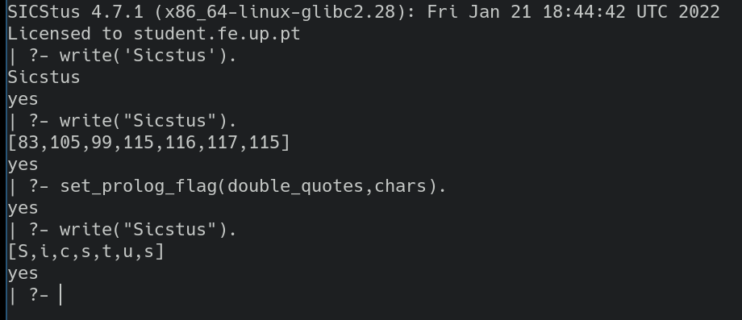
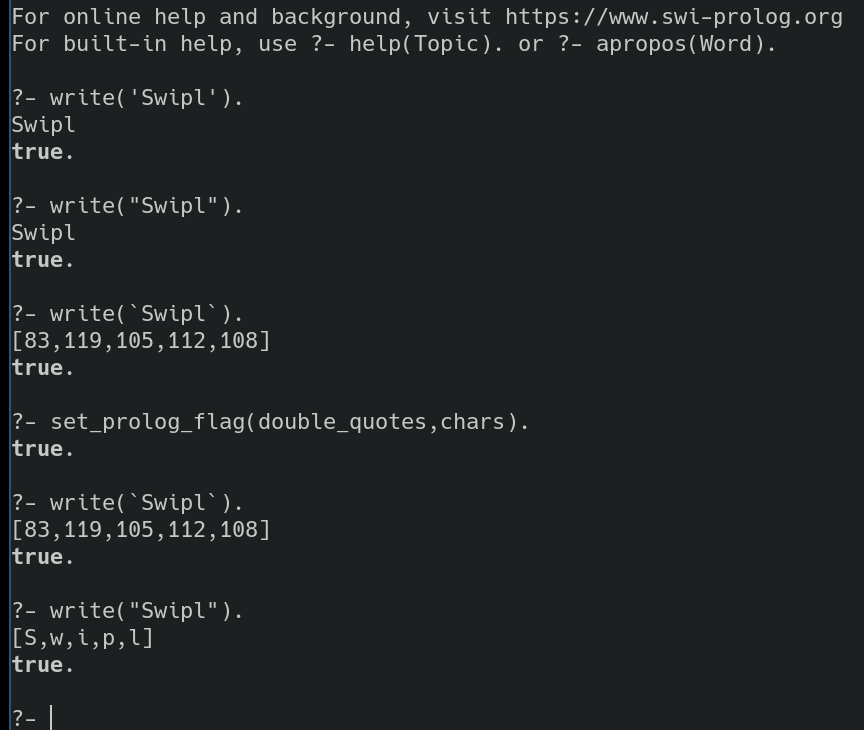

# Sicstus Vs Swipl

- Algumas notas nas diferenças que encontrei entre o `sicstus` e o `swipl`.

A maioria das soluções foram desenvolvidas usando o top-level do `swipl` visto
ser uma implementação gratuita do Prolog e o suportar **auto-completion**,
**history**,**melhores mensagens de erros**,**cores** etc.

Porém para o teste e o trabalho vamos ter que usar o `sicstus` (que não tem
nenhuma das features acima mencionadas)
então ficam aqui algumas diferenças que podem ser úteis saber.

## Strings

- Sicstus:

- Swipl:

